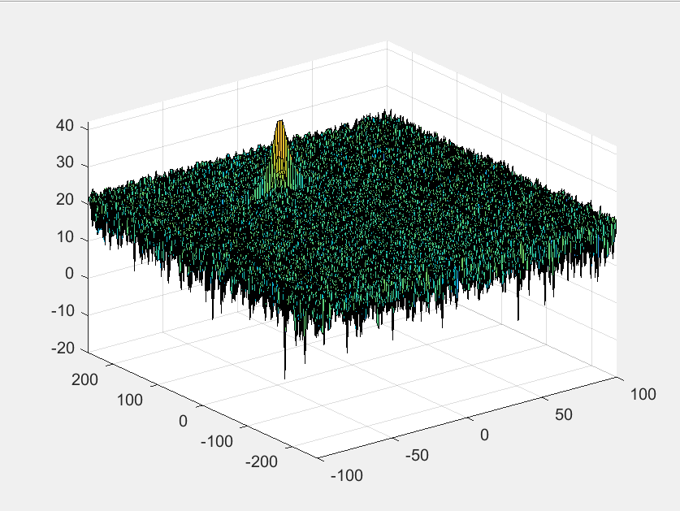

# SFND_Radar_Target_Generation_And_Detection

Objectives:  
* Using the given system requirements, design a FMCW waveform. Find its Bandwidth (B), chirp time (Tchirp) and slope of the chirp.
* Simulate target movement and calculate the beat or mixed signal for every timestamp.
* Implement the Range FFT on the Beat or Mixed Signal and plot the result.
* Implement the 2D CFAR process on the output of 2D FFT operation, i.e the Range Doppler Map.


## FMCW Waveform Design

System-level parameters below.    Resulting frequency sweep rate __slope__ is:  2.0455e13 [Hz/s].
```matlab

init_pos = 100;
vel = -20;   % doesn't change

%Operating carrier frequency of Radar 
fc = 77e9;             %carrier freq

range_resol = 1;
max_range = 200;

bw_sweep = c/(2*range_resol);
t_chirp = 5.5*2*max_range/c;

slope = bw_sweep/t_chirp;
```

## Simulation Loop

The simulation loop calculates the target movement (given above parameters) and beat frequency for every timestep.

```matlab
for i = 1:length(t)   
    r_t(i) = init_pos + t(i)*vel;    % updated position
    tr_ncols(i) = 2*r_t(i)/c;        % signal round-trip delay (tau)

    tdelay = t(i) - tr_ncols(i);
    Tx(i) = cos(2*pi*(fc*t(i) + (0.5*slope*t(i)^2)));             % transmitted
    Rx(i)  = cos(2*pi*(fc*tdelay + (0.5*slope*(tdelay^2))));      % received
 
    Mix(i) = Tx(i).*Rx(i);
end
```


## Range (1D FFT)

Implemented the 1D FFT on the mixer signal output, via reshaping and performing an FFT on the output, absolute value and normalizing to the number of samples.    Plots for the 1D FFT and Range Doppler Map below with signal peaks at expected values (range @ 100, doppler @ -20).

<p align="center"></p><br></br>

<p align="center"></p><br></br>

## 2D CFAR

### Implementation

The implementation of the CA-CFAR (Cell Averaging Constant False Alarm Rate) algorithm on the output of the 2D FFT utilized a second matrix to hold the target range and velocity data:

```matlab
threshold = zeros(size(RDM));
```

This allowed analysis of the affects of the following CA-CFAR meta parameters on detector performance.

```matlab

tr_nrows = 10;  % training/reference rows to use in both leading and lagging cells
tr_ncols = 8;  % training/reference columns to use n both leading and lagging cells

gd_nrows = 4;  % guard rows to mitigate CUT signal leakage into reference cells
gd_ncols = 4;  % guard cols to mitigate CUT signal leakage into reference cells

db_offset = 8;  % offset threshold in [db]

```

where the training and guard rows are defined as in the figure below:

<p align="center"></p><br></br>

The general CA-CFAR algorithm implemented involves:

1. Loop over all the rows (adjusting for training and guard rows)
2. Loop over all the columns (adjusting for training and guard columns)
3. Calculate the average power sum of the range-doppler map (RDM) of the training/reference cells as the outer sum - less inner sum (guard cells + CUT cell) and average.
4. If the value of the CUT cell exceeds the training/reference average + offset, then mark the indices of the CUT cell as a target.

The result of the CA-CFAR range-doppler detection algorithm is shown below (for parameters as seen above):

<p align="center"></p><br></br>

### Selection of Training/Guard Cells and Offset

The offset used in comparison of the CUT cell to the average of the training/reference cells defines Pfa, or the probability of false alarm (given some assumptions on background noise and detector design).  The offset [db] and Pfa are related by:

```matlab

alpha = 10^(db_offset/10);
pfa = 1/((1 + alpha/tr_ncells)^tr_ncells);

```

In the following tables and charts, we see that the offset is the primary influence of Pfa, and a larger training/reference area increases the discrimination between the signal and average of background noise (at the expense of other issues, such as closely-spaced multiple targets).  The combinations are:
| chart | db_offset | tr_nrows | tr_ncols | gd_nrows | gd_ncols | discr | Pfa |
|-------|----------:|---------:|---------:|---------:|---------:|------:|----:|
| top-left|   6     |   3      |      6   |     3    |    2     |   7.42db | 1.95% |
| top-right|   8     |   3      |      6   |     3    |    2     |   5.42db | 0.20% |
| top-left|   6     |   10      |      8   |     4    |    4     |  11.17db | 1.89% |
| top-right|   8     |   10     |      8   |     4    |    4     |   9.17db | 0.20% |

Where __discr__ is the max signal less the threshold, and Pfa is the probability of false alarm.   The following charts are created by slicing the range doppler maps and associated dynamic threshold at the peak signal value.


<p align="left">


</p><br></br>

<p align="left">


</p><br></br>


### Suppression of Non-threshold Cells

Because the CA-CFAR algorithm implemented does not modify the RDM data in-place, nothing was required to suppress the non-threshold cells for this discriminator (although one technique for suppressing non-threshold cells is left commented out within the code).


